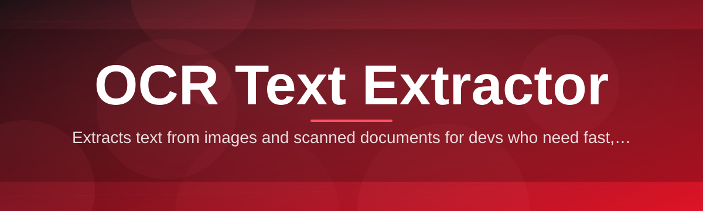
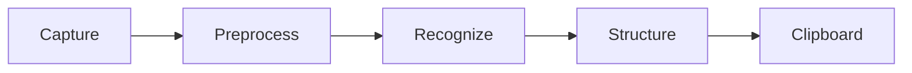

# ocr-text-extractor-tool 🔎📄

  

*Turn pixels into words — point, scan, copy, done.*

  

---

## 🧩 Overview

Text trapped inside images is dead weight. Screenshots, scanned PDFs, whiteboard photos, receipts — the words are right there, visible to your eyes, invisible to your clipboard. Retyping them is a waste of a human being's time.

**ocr-text-extractor-tool** is a lightweight Windows utility that rips text out of images and screen regions and puts it straight into your clipboard. No cloud upload, no account, no drama. It leans on modern OCR text extraction techniques — layout-aware recognition, multi-language detection, and noise-tolerant preprocessing — to handle real-world images, not just clean lab scans.

It's built for students digitizing lecture slides, developers grabbing error text from screenshots, translators lifting captions from foreign-language images, and anyone tired of manual transcription. If you've ever thought *"I just need the text from this picture"* — this is the tool that ends that sentence.

> [!NOTE]
> This is a standalone desktop tool. It runs locally on your machine — your images never leave your computer.

---

## ⚡ What It Actually Does

**TL;DR:** one tool, nine reasons to stop retyping text.

- **Screen-region capture** — draw a box anywhere on screen and extract the text inside it instantly, like a text-aware screenshot tool.

- **Batch image processing** — drop a folder of scans or photos and get a clean text file per image, no manual clicking required.

- **Multi-language recognition** — detects and reads dozens of languages and scripts, switching engines automatically based on content.

- **Layout preservation** — keeps paragraphs, tables, and line breaks intact instead of dumping one messy wall of text.

- **Clipboard-first workflow** — extracted text lands in your clipboard the moment it's ready, so paste-and-go is the default habit, not an extra step.

- **Noisy image tolerance** — built-in preprocessing (deskew, contrast boost, denoise) rescues text from blurry photos and low-quality scans.

- **PDF page extraction** — pull text out of scanned or image-based PDF pages without needing a separate converter.

- **History log** — every past extraction is saved locally so you can revisit yesterday's screenshot without redoing the scan.

- **Offline-first engine** — recognition runs entirely on-device; no internet connection required after installation.

---

## 🚀 Getting Started

**TL;DR:** visit, download, run, extract.

1. Open the landing page via the download button above.

2. Grab the latest Windows build — a single standalone package.

3. Launch the app (no setup wizard, no dependency installs).

4. Select a region or drop an image — your text appears in seconds.

> [!TIP]
> Pin the app to your taskbar. Most users trigger capture with a hotkey dozens of times a day once it becomes muscle memory.

---

## 🖥️ System Requirements

**TL;DR:** if it runs Windows 10 or 11, it runs this.

| Component | Minimum |
|---|---|
| OS | Windows 10 (64-bit) or Windows 11 |
| RAM | 2 GB free |
| Disk | ~150 MB |
| Dependencies | None — fully standalone |
| Internet | Not required after download |

> [!IMPORTANT]
> No runtime installs, no bundled frameworks to configure. Download, run, extract. That's the entire setup process.

---

## 🛠️ How It Works

**TL;DR:** capture → preprocess → recognize → deliver.

1. **Input capture** — a screen region, image file, or PDF page is fed into the pipeline.

2. **Preprocessing** — the image is deskewed, denoised, and contrast-normalized for cleaner recognition.

3. **Recognition engine** — character and layout models scan the cleaned image and detect language automatically.

4. **Structuring** — recognized text is reassembled into paragraphs, lines, and tables matching the original layout.

5. **Delivery** — final text is pushed to clipboard, on-screen preview, and optional saved log.

---

## 🧯 Troubleshooting

**TL;DR:** most issues are image quality, not the engine.

<strong>Extracted text looks garbled or has random characters</strong>

Usually caused by low image resolution or heavy compression. Try a higher-resolution source or enable the built-in contrast boost before extraction.

<strong>The tool didn't detect the correct language</strong>

Auto-detection can misfire on very short text snippets. Manually set the language in settings for short captions or single-line images.

<strong>Screen-region capture isn't triggering</strong>

Another app may be intercepting the same hotkey. Change the shortcut in settings under Keybindings.

<strong>PDF extraction skips some pages</strong>

Pages that are already text-based (not scanned images) are passed through as-is rather than re-recognized — check the output, the text is usually already there.

<strong>Clipboard paste is empty after extraction</strong>

Some clipboard managers clear content automatically. Disable clipboard-clearing extensions or check the in-app history log to recover the text.

---

## 🎨 UI / UX Details

**TL;DR:** dark by default, fast by design, fully keyboard-driven.

- **Themes** — Light, Dark, and a high-contrast mode for accessibility.

- **Keyboard shortcuts:**

  | Action | Shortcut |
  |---|---|
  | Capture region | `Ctrl + Shift + S` |
  | Extract from clipboard image | `Ctrl + Shift + V` |
  | Open history | `Ctrl + H` |
  | Toggle theme | `Ctrl + T` |

- **Settings panel** — language priority list, preprocessing toggles, hotkey remapping, auto-copy on/off.

- **Preview pane** — side-by-side original image and extracted text before you commit to copying.

  

---

## 🌱 Contributing & Community

**TL;DR:** this project grows through its contributors, not just its maintainers.

> [!TIP]
> First-time contributor? Look for issues tagged `good-first-issue` — small, well-scoped, and reviewed fast.

- **Discussions** — propose features, ask questions, share extraction workflows that worked well for you.

- **Roadmap** — language model improvements, expanded table-structure recognition, and community-requested format support are tracked openly.

- **Issues** — found a recognition edge case? File it with a sample image (redact anything sensitive first).

- **Pull requests** — fork, branch, code, submit. Clear descriptions get reviewed faster.

> [!WARNING]
> Do not submit copyrighted or sensitive documents as test samples in issues or PRs — use synthetic or public-domain images only.

---

## 📜 License

**TL;DR:** MIT, 2026, do what you want — just keep the notice.

Released under the [MIT License](LICENSE). Free to use, modify, and distribute — attribution appreciated, not required beyond the license terms.

---

## ⚠️ Disclaimer

**TL;DR:** OCR is powerful, not psychic.

This tool provides automated text extraction and may occasionally misread distorted, handwritten, or extremely low-quality images. Always review extracted text for accuracy before using it in critical documents, legal filings, or published work. The maintainers provide this software "as is," without warranty of any kind.

